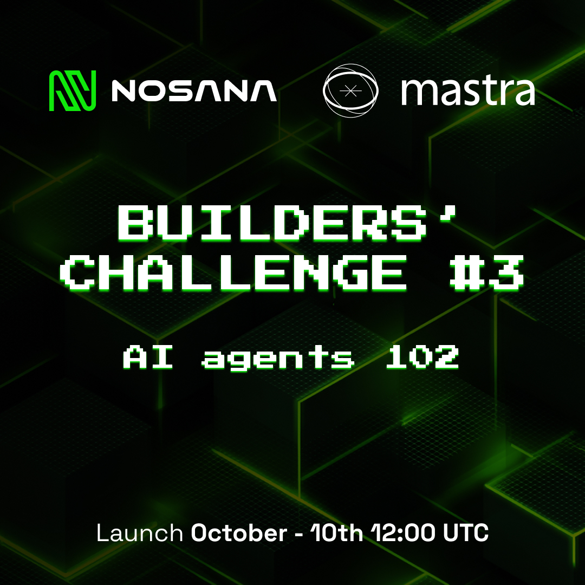

# Builders' Challenge #3: AI Agents 102
**Presented by Nosana and Mastra**



---

# 🚀 PITCH AI - AI Startup Pitch Agent

> **Transform your startup idea into an investor-ready pitch deck in seconds**

**Live Demo:** [Coming Soon - Deployed on Nosana]
**Docker Image:** `olathepavilion/agent-challenge:latest`
**Video Demo:** [Coming Soon]

## 📖 What is Pitch AI?

**Pitch AI** is an intelligent agent that helps founders, builders, and entrepreneurs transform raw startup ideas into professional, structured pitch decks instantly. Built with Mastra framework and deployed on Nosana's decentralized compute network.

### Key Features

✨ **Market Research** - Automatically researches competitors and market insights using Brave Search API
📝 **Smart Pitch Generation** - Creates structured investor-ready content (Problem, Solution, Market, Business Model, Tech Stack)
🎨 **Logo Generation** - Generates professional placeholder logos for your startup
📊 **Real-time Progress Tracking** - Watch as AI tools execute in real-time
📄 **PDF Export** - Download your complete pitch deck as a professional PDF
🎯 **Structured Input** - Guide the AI with your specific startup details

## 🛠️ How It Works

### Agent Architecture

```
User Input (Structured Form)
    ↓
Pitch Agent (OpenAI GPT-4o)
    ↓
┌─────────────────────────────────────┐
│  Tool 1: Research Tool (🔍)         │
│  → Brave Search API                 │
│  → Competitor analysis              │
│  → Market insights                  │
├─────────────────────────────────────┤
│  Tool 2: Pitch Formatter (📝)       │
│  → LLM-powered content generation   │
│  → Professional structuring         │
│  → Investor-ready language          │
├─────────────────────────────────────┤
│  Tool 3: Logo Generator (🎨)        │
│  → Visual branding                  │
│  → Placeholder logo creation        │
└─────────────────────────────────────┘
    ↓
Beautiful Neobrutalism UI Display
    ↓
PDF Export Ready
```

### Tools Implemented

#### 1. **researchTool** (`src/mastra/tools/researchTool.ts`)
- **Purpose:** Fetch real-time competitor and market data
- **API:** Brave Search API with intelligent fallback data
- **Features:**
  - HTML cleaning and entity decoding
  - Smart company name extraction
  - Sentence-boundary text truncation
  - Category-based intelligent fallbacks

#### 2. **pitchFormatterTool** (`src/mastra/tools/pitchFormatterTool.ts`)
- **Purpose:** Structure raw ideas into investor-ready pitch sections
- **Output:** Problem, Solution, Market, Business Model, Tech Stack
- **Features:** LLM-powered content expansion and professional formatting

#### 3. **generateLogoTool** (`src/mastra/tools/generateLogoTool.ts`)
- **Purpose:** Create visual branding for the startup
- **Output:** Professional placeholder logo with startup name

## 🎨 Frontend Features

- **Neobrutalism Design System** - Bold borders, vibrant colors, brutal shadows
- **Structured Input Form** - Name, Description, Audience, Problem, Business Model
- **Real-time Tool Progress Tracker** - See which tools are executing
- **Color-coded Pitch Sections** - Violet, Lime, Rose, Amber themed cards
- **Responsive Layout** - Works beautifully on mobile and desktop
- **PDF Export** - One-click download of complete pitch deck

## 🔧 Environment Variables Required

```env
# OpenAI API (for agent)
OPENAI_API_KEY=your-openai-key

# Brave Search API (for market research)
BRAVE_API_KEY=your-brave-api-key
```

## 🚀 Setup Instructions

### Local Development

```bash
# Clone the repository
git clone https://github.com/YOUR-USERNAME/agent-challenge
cd agent-challenge

# Install dependencies
pnpm install

# Set up environment variables
cp .env.example .env
# Edit .env with your API keys

# Run development servers
pnpm run dev:ui      # Frontend on http://localhost:3000
pnpm run dev:agent   # Agent server on http://localhost:4111
```

### Docker Deployment

```bash
# Build the Docker image
docker build -t olathepavilion/agent-challenge:latest .

# Test locally
docker run -p 3000:3000 -p 4111:4111 \
  -e OPENAI_API_KEY=your-key \
  -e BRAVE_API_KEY=your-key \
  olathepavilion/agent-challenge:latest

# Push to Docker Hub
docker push olathepavilion/agent-challenge:latest
```

## 📸 Screenshots

### Input Form
[Screenshot Coming Soon]

### Real-time Progress Tracking
[Screenshot Coming Soon]

### Generated Pitch Deck
[Screenshot Coming Soon]

### PDF Export
[Screenshot Coming Soon]

## 🎯 Example Usage

1. **Fill the form:**
   - Startup Name: "LedgerFlow"
   - Description: "AI-powered accounting for small businesses"
   - Target Audience: "SMBs and accountants"
   - Problem: "Manual bookkeeping is time-consuming"
   - Business Model: "Subscription-based SaaS"

2. **Chat with the agent:**
   ```
   "Generate a pitch deck for LedgerFlow"
   ```

3. **Watch the magic happen:**
   - 🔍 Researching Market & Competitors → ✅
   - 📝 Formatting Pitch Deck → ✅
   - 🎨 Generating Logo → ✅

4. **Get your professional pitch deck:**
   - Problem statement
   - Solution overview
   - Market analysis with competitors
   - Business model
   - Tech stack recommendations
   - Download as PDF

## 🏆 Technical Highlights

- **Framework:** Mastra for agent orchestration, CopilotKit for UI integration
- **LLM:** OpenAI GPT-4o
- **Search:** Brave Search API for real-time market data
- **Frontend:** Next.js 15 with Tailwind CSS
- **Design:** Custom neobrutalism design system
- **PDF Generation:** jsPDF with custom formatting
- **Deployment:** Docker containerized, ready for Nosana

## 📊 Performance

- ⚡ **Pitch Generation Time:** ~10-15 seconds
- 🔧 **Tools Executed:** 3 (Research, Format, Logo)
- 🎨 **UI Load Time:** < 1 second
- 📄 **PDF Generation:** Instant client-side

## 🎥 Demo Video

[Video will be uploaded to YouTube and linked here]

**Demo Flow:**
1. Show the structured input form
2. Submit startup details
3. Watch real-time tool execution progress
4. Display generated pitch deck with all sections
5. Show market research with real competitors
6. Download PDF and show the formatted output
7. Highlight Nosana deployment

## 🚢 Nosana Deployment

**Status:** Ready for deployment
**Docker Image:** `olathepavilion/agent-challenge:latest`
**Deployment URL:** [Will be added after deployment]

### Deployment Configuration

See `nos_job_def/nosana_mastra.json` for Nosana job definition.

---

## Welcome to the AI Agent Challenge

Build and deploy intelligent AI agents using the **Mastra framework** on the **Nosana decentralized compute network**. Whether you're a beginner or an experienced developer, this challenge has something for everyone!

## 🎯 Challenge Overview

**Your Mission:** Build an intelligent AI agent with a frontend interface and deploy it on Nosana's decentralized network.

### What You'll Build

Create an AI agent that performs real-world tasks using:
- **Mastra framework** for agent orchestration
- **Tool calling** to interact with external services
- **MCP (Model Context Protocol)** for enhanced capabilities
- **Custom frontend** to showcase your agent's functionality

### Agent Ideas & Examples

The possibilities are endless! Here are some ideas to get you started:

- 🤖 **Personal Assistant** - Schedule management, email drafting, task automation
- 📊 **Data Analyst Agent** - Fetch financial data, generate insights, create visualizations
- 🌐 **Web Researcher** - Aggregate information from multiple sources, summarize findings
- 🛠️ **DevOps Helper** - Monitor services, automate deployments, manage infrastructure
- 🎨 **Content Creator** - Generate social media posts, blog outlines, marketing copy
- 🔍 **Smart Search** - Multi-source search with AI-powered result synthesis
- 💬 **Customer Support Bot** - Answer FAQs, ticket routing, knowledge base queries

**Be Creative!** The best agents solve real problems in innovative ways.

## Getting Started Template

This is a starter template for building AI agents using [Mastra](https://mastra.ai) and [CopilotKit](https://copilotkit.ai). It provides a modern Next.js application with integrated AI capabilities and a beautiful UI.

## Getting Started

### Prerequisites & Registration

To participate in the challenge and get Nosana credits/NOS tokens, complete these steps:

1. Register at [SuperTeam](https://earn.superteam.fun/listing/nosana-builders-challenge-agents-102)
2. Register at the [Luma Page](https://luma.com/zkob1iae)
3. Star these repos:
   - [this repo](https://github.com/nosana-ci/agent-challenge)
   - [Nosana CLI](https://github.com/nosana-ci/nosana-cli)
   - [Nosana SDK](https://github.com/nosana-ci/nosana-sdk)
4. Complete [this registration form](https://e86f0b9c.sibforms.com/serve/MUIFALaEjtsXB60SDmm1_DHdt9TOSRCFHOZUSvwK0ANbZDeJH-sBZry2_0YTNi1OjPt_ZNiwr4gGC1DPTji2zdKGJos1QEyVGBzTq_oLalKkeHx3tq2tQtzghyIhYoF4_sFmej1YL1WtnFQyH0y1epowKmDFpDz_EdGKH2cYKTleuTu97viowkIIMqoDgMqTD0uBaZNGwjjsM07T)

### Setup Your Development Environment

#### **Step 1: Fork, Clone and Quickstart**

```bash
# Fork this repo on GitHub, then clone your fork
git clone https://github.com/YOUR-USERNAME/agent-challenge

cd agent-challenge

cp .env.example .env

pnpm i

pnpm run dev:ui      # Start UI server (port 3000)
pnpm run dev:agent   # Start Mastra agent server (port 4111)
```

Open <http://localhost:3000> to see your agent in action in the frontend.
Open <http://localhost:4111> to open up the Mastra Agent Playground.

#### **Step 2: Choose Your LLM for Development (Optional)**

Pick one option below to power your agent during development:

##### Option A: Use Shared Nosana LLM Endpoint (Recommended - No Setup!)

We provide a free LLM endpoint hosted on Nosana for development. Edit your `.env`:

```env
# Qwen3:8b - Nosana Endpoint
# Note baseURL for Ollama needs to be appended with `/api`
OLLAMA_API_URL=https://3yt39qx97wc9hqwwmylrphi4jsxrngjzxnjakkybnxbw.node.k8s.prd.nos.ci/api
MODEL_NAME_AT_ENDPOINT=qwen3:8b
```

If it goes down, reach out on [Discord](https://discord.com/channels/236263424676331521/1354391113028337664)

##### Option B: Use Local LLM

Run Ollama locally (requires [Ollama installed](https://ollama.com/download)):

```bash
ollama pull qwen3:0.6b
ollama serve
```

Edit your `.env`:
```env
OLLAMA_API_URL=http://127.0.0.1:11434/api
MODEL_NAME_AT_ENDPOINT=qwen3:0.6b
```

##### Option C: Use OpenAI

Add to your `.env` and uncomment the OpenAI line in `src/mastra/agents/index.ts`:

```env
OPENAI_API_KEY=your-key-here
```

## 🏗️ Implementation Timeline

**Important Dates:**
- Start Challenge: 10 October
- Submission Deadline: 31 October
- Winners Announced: 07 November

### Phase 1: Development

1. **Setup** : Fork repo, install dependencies, choose template
2. **Build** : Implement your tool functions and agent logic
3. **Test** : Validate functionality at http://localhost:3000

### Phase 2: Containerization

1. **Clean up**: Remove unused agents from `src/mastra/index.ts`
2. **Build**: Create Docker container using the provided `Dockerfile`
3. **Test locally**: Verify container works correctly

```bash
# Build your container (using the provided Dockerfile)
docker build -t yourusername/agent-challenge:latest .

# Test locally first
docker run -p 3000:3000 yourusername/agent-challenge:latest 

# Push to Docker Hub
docker login
docker push yourusername/agent-challenge:latest
```

### Phase 3: Deployment to Nosana
1. **Deploy your complete stack**: The provided `Dockerfile` will deploy:
   - Your Mastra agent
   - Your frontend interface
   - An LLM to power your agent (all in one container!)
2. **Verify**: Test your deployed agent on Nosana network
3. **Capture proof**: Screenshot or get deployment URL for submission

### Phase 4: Video Demo

Record a 1-3 minute video demonstrating:
- Your agent **running on Nosana** (show the deployed version!)
- Key features and functionality
- The frontend interface in action
- Real-world use case demonstration
- Upload to YouTube, Loom, or similar platform

### Phase 5: Documentation

Update this README with:
- Agent description and purpose
- What tools/APIs your agent uses
- Setup instructions
- Environment variables required
- Example usage and screenshots

## ✅ Minimum Requirements

Your submission **must** include:

- [ ] **Agent with Tool Calling** - At least one custom tool/function
- [ ] **Frontend Interface** - Working UI to interact with your agent
- [ ] **Deployed on Nosana** - Complete stack running on Nosana network
- [ ] **Docker Container** - Published to Docker Hub
- [ ] **Video Demo** - 1-3 minute demonstration
- [ ] **Updated README** - Clear documentation in your forked repo
- [ ] **Social Media Post** - Share on X/BlueSky/LinkedIn with #NosanaAgentChallenge

## Submission Process

1. **Complete all requirements** listed above
2. **Commit all of your changes to the `main` branch of your forked repository**
   - All your code changes
   - Updated README
   - Link to your Docker container
   - Link to your video demo
   - Nosana deployment proof
3. **Social Media Post** (Required): Share your submission on X (Twitter), BlueSky, or LinkedIn
   - Tag @nosana_ai
   - Include a brief description of your agent
   - Add hashtag #NosanaAgentChallenge
4. **Finalize your submission on the [SuperTeam page](https://earn.superteam.fun/listing/nosana-builders-challenge-agents-102)**
   - Add your forked GitHub repository link
   - Add a link to your social media post
   - Submissions that do not meet all requirements will not be considered

## 🚀 Deploying to Nosana


### Using Nosana Dashboard
1. Open [Nosana Dashboard](https://dashboard.nosana.com/deploy)
2. Click `Expand` to open the job definition editor
3. Edit `nos_job_def/nosana_mastra.json` with your Docker image:
   ```json
   {
     "image": "yourusername/agent-challenge:latest"
   }
   ```
4. Copy and paste the edited job definition
5. Select a GPU
6. Click `Deploy`

### Using Nosana CLI (Alternative)
```bash
npm install -g @nosana/cli
nosana job post --file ./nos_job_def/nosana_mastra.json --market nvidia-3090 --timeout 30
```

## 🏆 Judging Criteria

Submissions evaluated on 4 key areas (25% each):

### 1. Innovation 🎨
- Originality of agent concept
- Creative use of AI capabilities
- Unique problem-solving approach

### 2. Technical Implementation 💻
- Code quality and organization
- Proper use of Mastra framework
- Efficient tool implementation
- Error handling and robustness

### 3. Nosana Integration ⚡
- Successful deployment on Nosana
- Resource efficiency
- Stability and performance
- Proper containerization

### 4. Real-World Impact 🌍
- Practical use cases
- Potential for adoption
- Clear value proposition
- Demonstration quality

## 🎁 Prizes

**Top 10 submissions will be rewarded:**
- 🥇 1st Place: $1,000 USDC
- 🥈 2nd Place: $750 USDC
- 🥉 3rd Place: $450 USDC
- 🏅 4th Place: $200 USDC
- 🏅 5th-10th Place: $100 USDC each

## 📚 Learning Resources

For more information, check out the following resources:

- [Nosana Documentation](https://docs.nosana.io)
- [Mastra Documentation](https://mastra.ai/en/docs) - Learn more about Mastra and its features
- [CopilotKit Documentation](https://docs.copilotkit.ai) - Explore CopilotKit's capabilities
- [Next.js Documentation](https://nextjs.org/docs) - Learn about Next.js features and API
- [Docker Documentation](https://docs.docker.com)
- [Nosana CLI](https://github.com/nosana-ci/nosana-cli)
- [Mastra Agents Overview](https://mastra.ai/en/docs/agents/overview)
- [Build an AI Stock Agent Guide](https://mastra.ai/en/guides/guide/stock-agent)
- [Mastra Tool Calling Documentation](https://mastra.ai/en/docs/agents/tools)

## 🆘 Support & Community

### Get Help
- **Discord**: Join [Nosana Discord](https://nosana.com/discord) 
- **Dedicated Channel**: [Builders Challenge Dev Chat](https://discord.com/channels/236263424676331521/1354391113028337664)
- **Twitter**: Follow [@nosana_ai](https://x.com/nosana_ai) for live updates

## 🎉 Ready to Build?

1. **Fork** this repository
2. **Build** your AI agent
3. **Deploy** to Nosana
4. **Present** your creation

Good luck, builders! We can't wait to see the innovative AI agents you create for the Nosana ecosystem.

**Happy Building!** 🚀

## Stay in the Loop

Want access to exclusive builder perks, early challenges, and Nosana credits?
Subscribe to our newsletter and never miss an update.

👉 [ Join the Nosana Builders Newsletter ](https://e86f0b9c.sibforms.com/serve/MUIFALaEjtsXB60SDmm1_DHdt9TOSRCFHOZUSvwK0ANbZDeJH-sBZry2_0YTNi1OjPt_ZNiwr4gGC1DPTji2zdKGJos1QEyVGBzTq_oLalKkeHx3tq2tQtzghyIhYoF4_sFmej1YL1WtnFQyH0y1epowKmDFpDz_EdGKH2cYKTleuTu97viowkIIMqoDgMqTD0uBaZNGwjjsM07T)

Be the first to know about:
- 🧠 Upcoming Builders Challenges
- 💸 New reward opportunities
- ⚙ Product updates and feature drops
- 🎁 Early-bird credits and partner perks

Join the Nosana builder community today — and build the future of decentralized AI.


